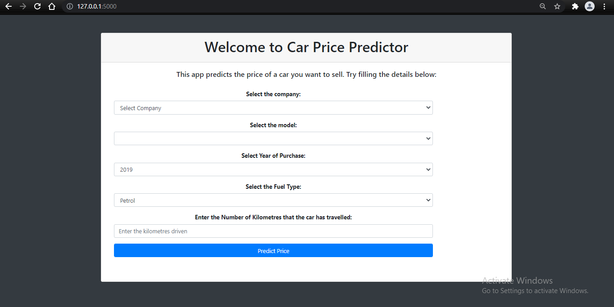
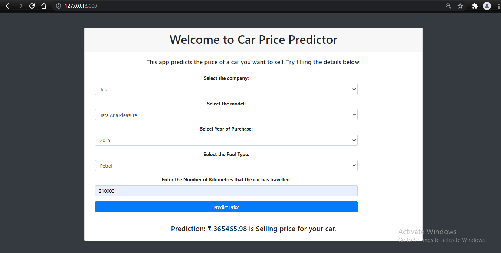
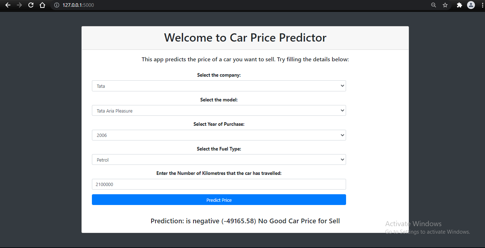

# Used-Car-Price-Prediction
Car Price Prediction is a really an interesting machine learning problem as there are many factors that influence the price of a car in the second-hand market. 

------
# Aim

This project aims to predict the Price of an used Car by taking it's Company name, it's Model name, Year of Purchase, and other parameters.

## Images for Application

-----

-----

